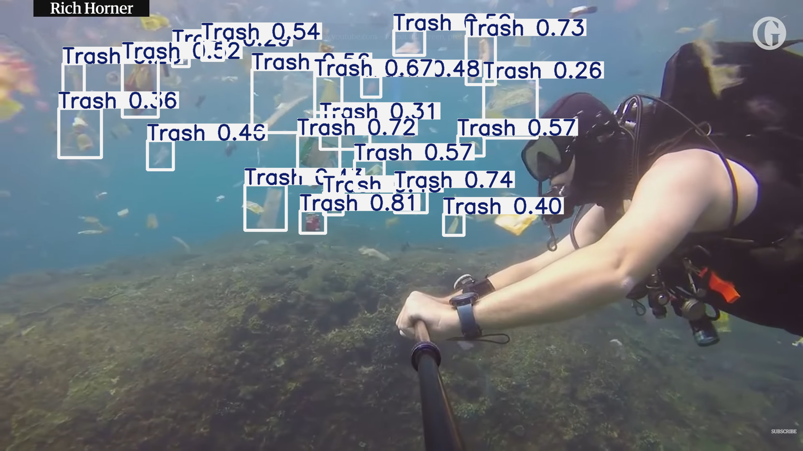
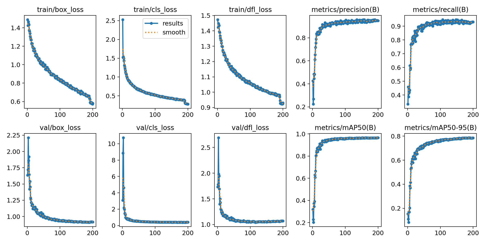
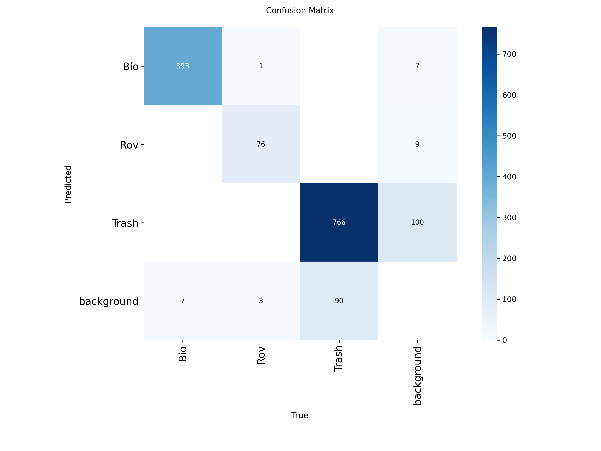
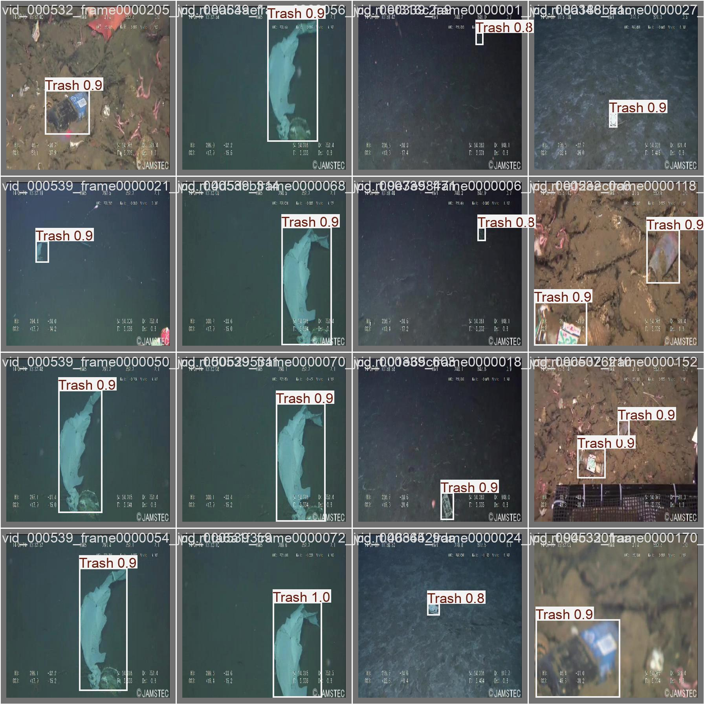

# Underwater Trash Detection using YOLOv8



## 📌 Overview
This project focuses on the automated detection of underwater debris using the **YOLOv8** (You Only Look Once) architecture. By leveraging computer vision, we aim to assist Marine Research and underwater cleanup operations by identifying trash, marine life, and ROV equipment in real-time.

---

## 🚀 Features
- **Real-time Detection**: High-speed processing suitable for ROV integration.
- **Three-Class Classification**:
    - 🟥 **Trash**: Man-made debris (plastic, metal, glass).
    - 🟩 **Bio**: Marine life and biological features.
    - 🟦 **Rov**: Parts of the underwater vehicle/tools.
- **Optimized Model**: Uses `yolov8s` for a balance between accuracy and performance.

---

## 📊 Training Results
The model was trained for **200 epochs** on a specialized underwater dataset.

### Performance Curves
The following metrics illustrate the model's learning progress, showing loss reduction and Mean Average Precision (mAP) improvement.


### Model Evaluation
| Confusion Matrix | Validation Predictions |
| :---: | :---: |
|  |  |

---

## 🛠️ Installation & Usage

### 1. Requirements
Ensure you have Python installed, then install the necessary dependencies:
```bash
pip install ultralytics roboflow
```

### 2. Running Predictions
To use the trained model for inference on new images or videos:
```python
from ultralytics import YOLO

# Load the model
model = YOLO('best.pt')

# Predict on an image
results = model.predict(source='result_yolov8.png', save=True, imgsz=416)
```

---

## 📂 Project Structure
- `yolov8.ipynb`: Main notebook covering data downloading, training, and validation.
- `result_train/`: Contains all training logs, plots, and evaluation metrics.
- `result_yolov8.png`: A sample prediction result showcase.
- `data_yolov8.yaml`: Configuration file for the dataset paths and classes.

---

## 🌊 Why it Matters
Marine pollution is a global crisis. Manually monitoring underwater environments is labor-intensive and expensive. This AI-driven approach enables:
- **Scalable Monitoring**: Simultaneous deployment of multiple autonomous agents.
- **Data-Driven Conservation**: Better insights into trash accumulation zones.
- **Efficient Cleanup**: Directing resources specifically to detected "Trash" hotspots.

---
> **Disclaimer**: This project was developed as part of a bootcamp project focusing on applying YOLOv8 to environmental challenges.
